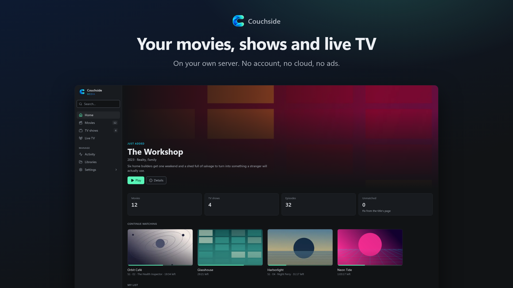
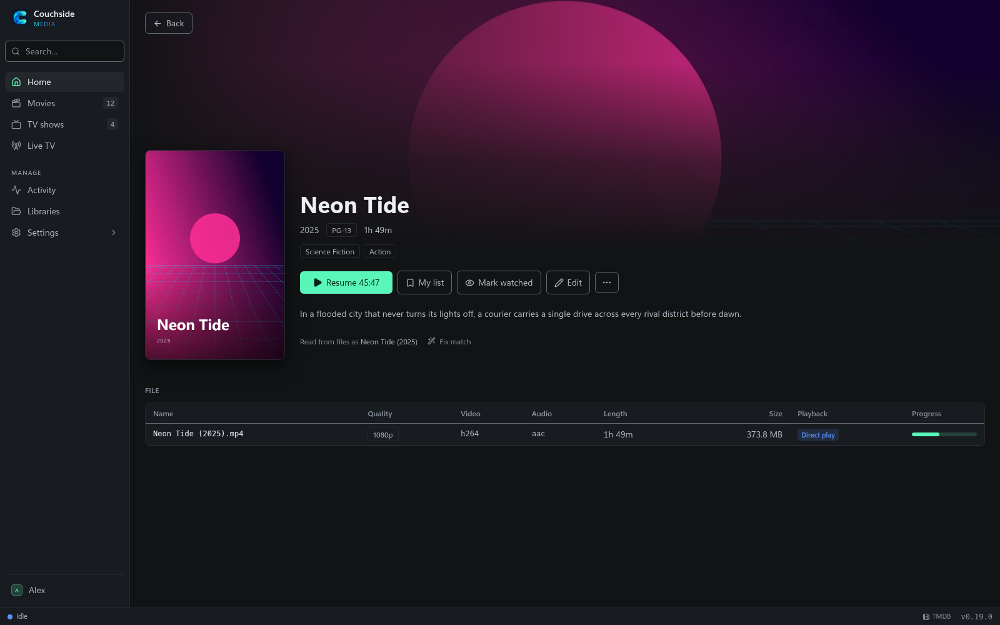
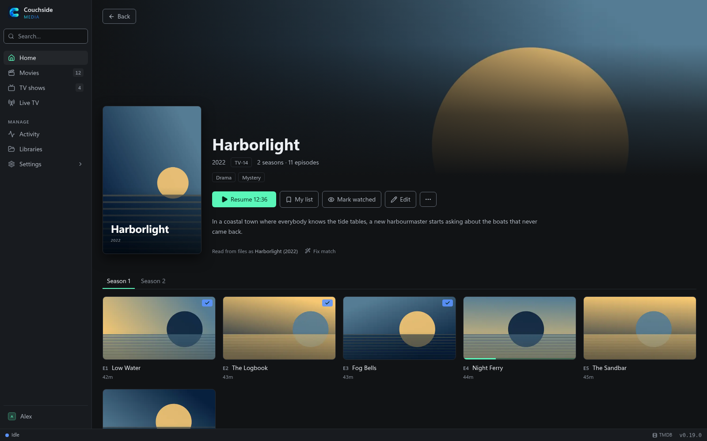
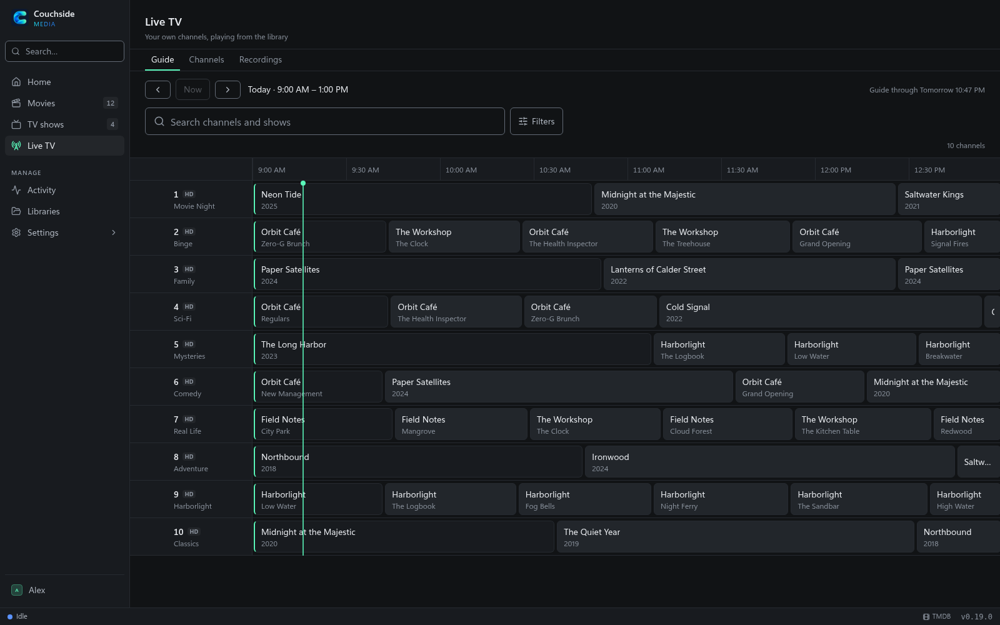
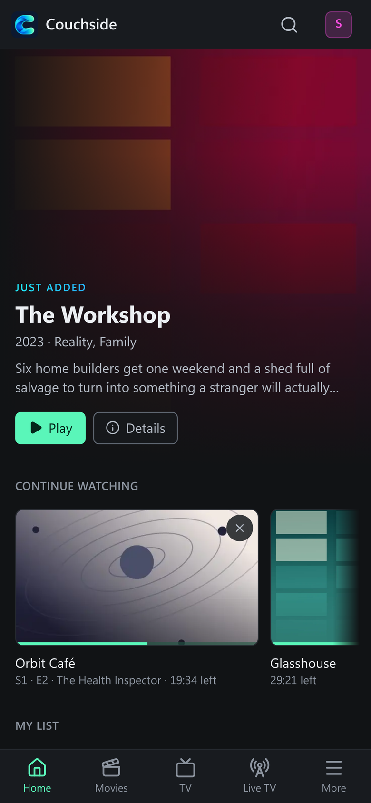
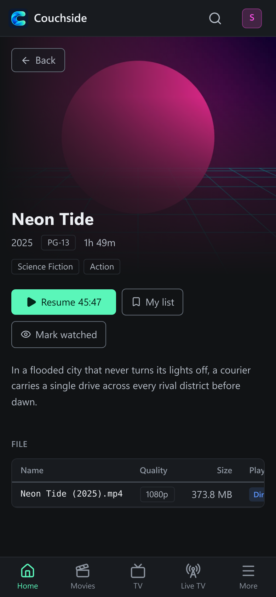

<p align="center"></p>

# Couchside

A fast, lightweight media server for your movies, shows and live TV.
[couchside.app](https://couchside.app)

<p align="center"></p>

- **Fast and light.** One small binary with SQLite built in. Runs on a NAS, a Pi or k3s.
- **Local only.** No cloud account, no telemetry. Everything it fetches is cached on your server.
- **Live TV and DVR.** HDHomeRun guide, series recordings, commercial skipping, and your own channels made from your library.
- **A good UI.** A dark web app that works on phones, a Plex-style player, and a Roku app.

Also: TMDB matching with cast and artwork, GPU transcoding (Intel and AMD VAAPI in
the container; NVIDIA NVENC and Intel Quick Sync with the Windows installer), HDR
tone mapping, and profiles for the whole household.

## Screenshots

| | |
| --- | --- |
|  |  |
|  |  |

<p align="center">
  
  &nbsp;
  
</p>

The library shown is invented, with generated artwork. The screenshots are made
by a script that runs a real Couchside server on sample media.

## Quick start

```bash
docker run -d --name couchside -p 8080:8080 \
  -v couchside-data:/data -v couchside-cache:/cache \
  -v /path/to/media:/media \
  ghcr.io/timothydodd/couchside:latest
```

Open http://localhost:8080 and add a library. For live TV, add
`-e COUCHSIDE_HDHOMERUN=<tuner IP>` and `-v couchside-recordings:/recordings`.
`docker compose up -d` with this repo's `docker-compose.yml` does the same with
media from `./media`. Zips for Linux, macOS and Windows are on the
[Releases page](https://github.com/timothydodd/couchside/releases).

## Docs

[Install](docs/install.md) ·
[Configuration](docs/configuration.md) ·
[Libraries](docs/library.md) ·
[Playback](docs/playback.md) ·
[Live TV and DVR](docs/live-tv.md) ·
[Accounts](docs/accounts.md) ·
[Development](docs/development.md)

## License and credits

[MIT](LICENSE). Bundled software keeps its own licenses; see
[THIRD_PARTY_NOTICES.txt](THIRD_PARTY_NOTICES.txt).

<a href="https://www.themoviedb.org"></a>
This product uses the TMDB API but is not endorsed or certified by TMDB.

Fallback metadata from [OMDb](https://www.omdbapi.com) ([CC BY-NC 4.0](https://creativecommons.org/licenses/by-nc/4.0/)), optional: its data is for non-commercial use, so leave `OMDB_API_KEY` unset where Couchside is used commercially.
Video by [FFmpeg](https://ffmpeg.org) and commercial detection by
[Comskip](https://github.com/erikkaashoek/Comskip) (both GPL, shipped in the image).
HDHomeRun is a trademark of SiliconDust USA Inc.; Couchside isn't affiliated with them.
